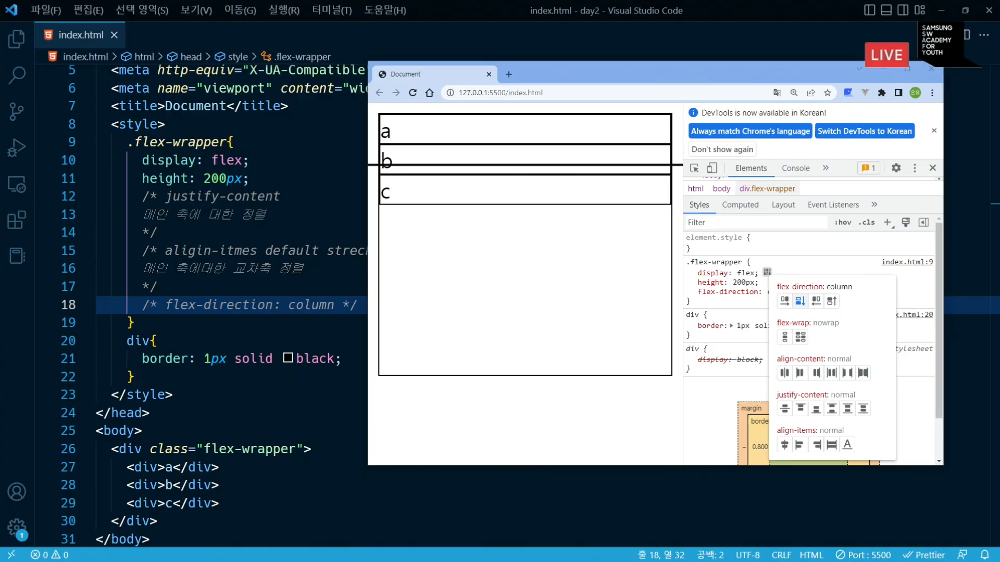

## CSS
### display:flex; 를 사용하여 아래 화면에서 이것 저것 만져보기 (개발자 도구)
<br><br>

### display 속성과 position 속성의 차이
display 속성(inline, block, inline-block, ) 은 2차원 속성
position 속성은 3차원

월말 평가: 다음주 목요일 (액자 하나에 뭐 넣어서 어쩌고 코딩)
과목 평가: 사지선다인데 서술형도 있고 인터넷으로 본다. 알고리즘 2주가 끝나고 난 다음에 월요일 (웹)

금요일 총 복습때 메모 잘 하면 걱정 없을 것이다. 그것만 해도 반은 맞는다.
그런데 그렇게 해도 잘 못하더라. 퍼다주는 수준이였는데 평균 80이 안된다.
특히 임베디드 쪽으로 가면.
PASS 는 60인데 60만 맞으면 안된다. (선생님이 혼나서)

### JS는 언어인가 아닌가
if for 배열 변수 사용가능 유무 (튜링 어쩌고)
<hr/>

## JavaScript 첫 강의
### 변수의 선언 (var, const, let)
```js
var a = 1;
var a = 2; // 위험해서 var 쓰면 안됨.

const a;
a = 1;
console.log(a); // 초기화 안하고 넘어가는걸 막아준다.

const a = 1;
const a = 2;
console.log(a); // 안된다. 두번 배정 막아준다.

const a = 1; // constant variable 상수 변수, 원래 있던 변수를 바꾸는 것은 허용 되지 않음.
a = 2; // 왜 쓰라고 하냐, 웹에서 데이터는 너무 중요해서 웬만해선 바뀌면 안된다. (immutability) 99%의 상황.
console.log(a);

let a = 1; // 1퍼센트의 상황 (내가 바꾸고자 하는 게 있을 때 사용)
a = 2;
console.log(a); 
```
<br>
### 0, null, undefined 차이
```js
console.log(typeof null); // 결과: object
console.log(typeof undefined); // 결과: undefined
```
0: 수치로서의 0
null: 개발자가 의도적으로 비워둔 것.
undefined: 개발자가 의도치 않은 것. (에러는 아님)
<br>

### 배열(array)
```js
const arr = [1, 'a', true]; // 가능하지만 쓰면 안 좋음
console.log(arr);
console.log(typeof arr); // 결과: object, array 는 object안에 있음
```
<br>
```js
const arr = [1, 2, 3];
console.log(arr[3]); // 결과: 에러가 아닌 undefined (디버깅 할 때 주의)
```
<hr>

### html안에 JS 문법을 어디에 넣어야 하는가?
`<body>` 태그 안의 맨 밑 (에러를 피하기 위함)
```html
<!DOCTYPE html>
<html lang="en">
<head>
    <meta charset="UTF-8">
    <meta http-equiv="X-UA-Compatible" content="IE=edge">
    <meta name="viewport" content="width=device-width, initial-scale=1.0">
    <title>Document</title>
</head>
<body>
    <h1>하이</h1>
    <script>
        alert("hi");
    </script>
</body>
</html>
```
<br>

### 함수 선언
```js
function addOne(n) { // function으로 함수 선언
    console.log("hi");
    return n + 1; // 리턴 타입 자동
}

console.log(addOne(2));

// 결과값: hi, 3;
```
<br>
### 비동기 함수 선언
함수를 호출 라인보다 아래에 선언했다. 가능은 하지만 함수 선언은 위에 하는게 좋다.
```js
console.log(addOne(2));

function addOne(n) { // function으로 함수 선언
    console.log("hi");
    return n + 1; // 리턴 타입 자동
}
```
<br>
### 함수 표현식
#### 함수는 변수인가? (JS에서는 그렇다.)
- 함수를 변수에 저장
- 함수가 저장된 변수를 호출하면, 해당 함수가 호출 됨
- 이 개념은 많이 쓰이니 알아두는게 좋다.

```js
function retA () {
    return 'a';
}

const sample = retA; // 소괄호가 없다.
console.log(typeof sample);
```
**결과:** `function`
<br>
#### 익명함수 (무명함수)
```js
const sampleFunc = function () { // lambda (무명 함수)
    return 1;
} // sampleFunc은 함수가 됐다.

const result = sampleFunc();
console.log(result);
```
<br>
<hr>
##JavaScript를 배우는데 중요한 개념
1. 객체 object
2. 함수 function
3. 배열 array
<br>
### 객체
>**객체 object : key와 value로 이루어진 property의 모음 (시험에 나옴)**

<br/>
아래와 같은 경우에는 각각의 property가 무엇을 의미하는지 알기 어렵다.

```js
const person = [
    "Phabala",
    1997,
    ["아빠", "엄마", "할머니"],
    "테니스 선수",
    true,
];
```
<br/>

객체로써 `property`를 `key`와 `value`로 다음처럼 사용한다면
```js
const person = {
    name: "Phabala",
    dateOfBirth: 1997,
    familyMembers: ["아빠", "엄마", "할머니"],
    job: "테니스 선수",
    isMerriaged: true,
};

// 응용
console.log(person.name); // result: Phabala
```
<br>

### 메소드: 객체 안에 있는 함수
`console.log` 는 `console` 객체 안에 있는 `log`라는 메소드다.
<br>

### const와 value의 상관 관계
`const` 로 객체를 선언했어도, 객체의 `value`는 바꿀 수 있다.
`key`는 밀어넣으면 넣을수는 있다.
```js
const person = {
    name: "Phabala",
    dateOfBirth: 1997,
    familyMembers: ["아빠", "엄마", "할머니"],
    job: "테니스 선수",
    isMerriaged: true,
};

person.hometown = "경남 함양군";
// person의 key에 hometown 이 추가됨.
```
<br>
####위의 개념 응용
```js
const arr = [1, 2, 3];
arr.push(4);
console.log(arr) // result: [1, 2, 3, 4];
```
<br>

###cf.
지금까지 클래스에 대한 개념 없이 객체를 설명했는데, 클래스 개념 없이 객체를 설명이 가능하다.